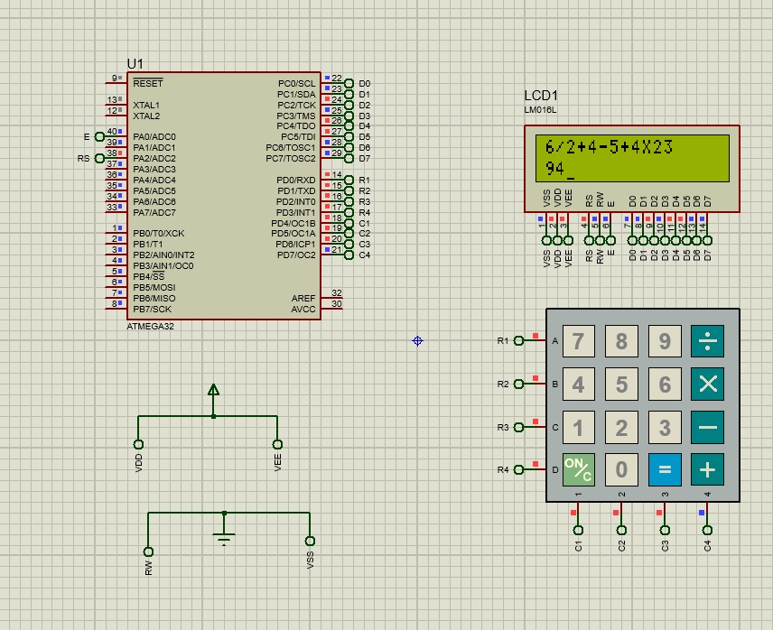

# Calculator Project

This repository contains the source code for a calculator implemented in C for embedded systems.

## Features

- **Arithmetic Operations**: Supports addition (+), subtraction (-), multiplication (*), and division (/) operations.
- **Infix to Postfix Conversion**: Converts infix expressions to postfix notation for efficient evaluation.
- **Stack Data Structure**: Utilizes a stack data structure for infix to postfix conversion, ensuring efficient evaluation.
- **Intelligent Precedence Handling**: The calculator intelligently manages the precedence of operations, ensuring accurate evaluation according to mathematical rules.

## Usage

- Press the numeric keys (0-9) on the keypad to enter digits.
- Use the '+' key for addition, '-' key for subtraction, 'X' key for multiplication, and '/' key for division.
- Press the '=' key to evaluate the expression and display the result on the CLCD.
- Press the 'On/c' key to clear the expression and start over.

## Screenshots

## Proteus Simulation

A Proteus simulation and hex files are included in the repository for testing the calculator functionality in a virtual environment.

